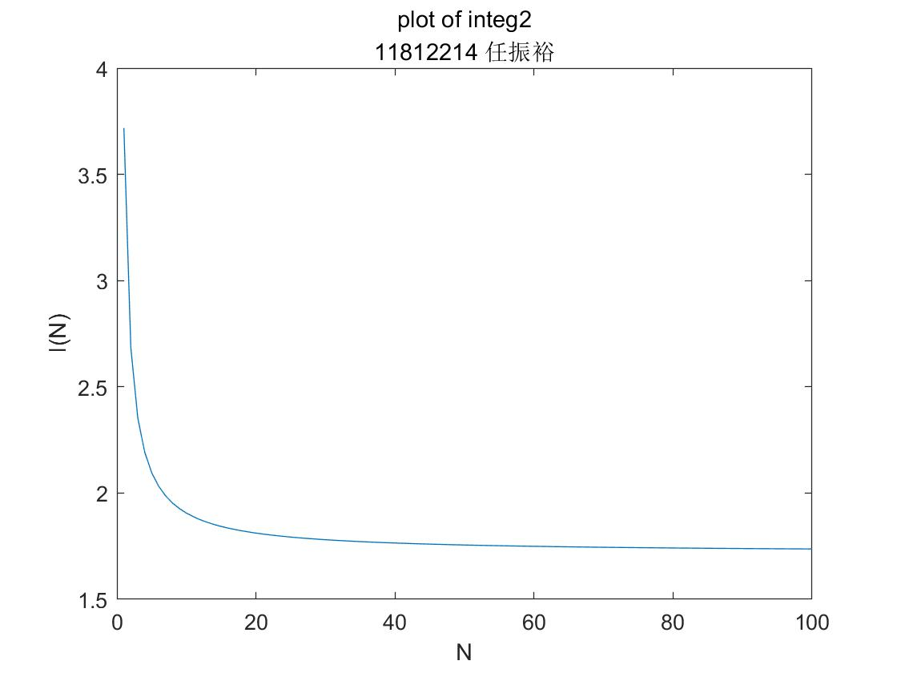

## <center>EE323 Digital Signal Processing</center>
## <center>Lab 1: Discrete and Continuous-Time Signals </center>

>  **SID:** 11812214  
>
> **Name:** 任振裕

### **Part 1: Introduction.**

***

+ The purpose of this lab is to illustrate the properties of continuous and discrete-time signals using digital computers and the Matlab software environment. 
+ The main content discussed in this lab:

  + Start with Matlab and learn some basic commands;
  + Numerical computation of continuous signals;
  + Special functions such as $sinc(t),rect(t),u[n]$ and etc;
  + Illustrate the process of sampling;
  + Processing of speech signal and 2-D signal;

### **Part 2: Result & Analysis.**

***

#### **1.3 Continuous-Time Vs. Discrete-Time**

**1.3.1 Analytical Calculation** 

$(1) \int_0^{2\pi}sin^2(5t)dt:$
$$
\begin{aligned}
\int_0^{2\pi}sin^2(5t)dt&=\int_0^{2\pi}\frac{1-cos(10t)}{2}dt\\
&=\frac{t}{2}-\frac{sin(10t)}{20}\bigg|_{t=0}^{2\pi}\\
&=\pi
\end{aligned}
$$
$(2) \int_0^1e^tdt:$
$$
\int_0^1e^tdt=e^t\bigg|_{t=0}^1 = e-1
$$
**1.3.2 Displaying Continuous and Discrete-Time Signals in Matlab**

+ Result:


<center>Fig.1 three signals</center>

+ Analysis: 

  The first continuous time plot is more accurate than the second continuous time plot.

**1.3.3 Numerical Computation of Continuous-Time Signals**

+ Codes for two Matlab functions:

  ```matlab
  function I=integ1(N)
  % numerically computing the integral of sin^2(5t) over [0,2*pi];
  n=0:N;
  nt=2*pi/N*n;
  y=(sin(5*nt)).^2;
  s=y*(2*pi/N);
  I=sum(s);
  end
  ```

  ```matlab
  function I = integ2(N)
  % numerically computing the integral of exp (t) on the interval [0,1]
  n=0:N;
  nt=1/N*n;
  y=exp(nt);
  s=y*(1/N);
  I=sum(s);
  end
  ```

+ Result:


<center>Fig.2 plot of integ1</center>



<center>Fig.3 plot of integ2</center>

+ Analysis:
  + As $N \to 100$, we have $integ1(N) \to \pi$, and $integ2(N) \to e-1$, which means that using Riemann Integral to estimate the integral of $sin^2(5t)$ and $e^t$ is practicable.
  + When $N=5, N=10$, $\Delta t$ equals $\frac{2 \pi}{5}$ and $\frac{\pi}{5}$, which indicates that the start points of interval just occur at the zero point of $sin^2(5t)$, making the integral equals zero when $N$ equals 5 and 10.

#### **1.4 Processing of Speech Signals (Optional)**

+ Result:

  

<center>Fig.4 plot of speech signal</center>

+ Analysis:
  + According to Matlab code `[signal,fs]=audioread('speech.au');`, we could load the speech signal and read its sampling frequency $f_s$;
  
  + The last time for the speech signal could be derived by $t=\frac{length(speech signal)}{sampling frequency \   f_s}$.
  
  + Use below Matlab command to sound the loaded signal:
  
    ```matlab
    sound(signal,fs);
    ```

#### **1.5 Special Functions**

+ Result:

  

<center>Fig.5 plots of sinc(t) and rect(t)</center>


​                                                                 Fig.6 plots of $a^n(u[n]-u[n-10])$


​                                                                        Fig.7 plots of $cos(wn)a^nu[n]$

#### **1.6 Sampling**

+ Result:


<center>Fig.8 plots of sampling</center>

+ Analysis:

  The version of signal with $T_s = 1/10$ is more likely to the original sampled signal compared to those with $T_s=1/3, T_s=1/2,$ and $T_s=10/9$.

#### **1.7 Random Signals**

+ Result:


<center>Fig.9 plots of sig1 and sig2</center>


<center>Fig.10 plot of ave1</center>


<center>Fig.11 plot of ave2</center>

+ Analysis:

  + Since $sig1 \sim N(0,1)$, and $sig2 \sim N(0.2,1)$, we could use Matlab code below to obtain this two signals:

  ```matlab
  sig1=random('norm',0,1,1,1000);
  sig2=random('norm',0.2,1,1,1000);
  ```

  + As $n \to 1000$, we have the average values gradually tend to means of the signal, which is:
    $$
    \begin{aligned}
    ave1(n) &\to mean(sig1)=0, as\ n \to 1000 \\
    ave2(n) &\to mean(sig2)=0.2, as\ n \to 1000
    \end{aligned}
    $$
  + Therefore, we could use average values to estimate means when $n$ is enough large to distinguish random noises. 

#### **1.8 2-D Signals (Optional)**

+ Result:

  
  
  <center>Fig.12 plot of surface</center>
  


  <center>Fig.13 image of 2-D signal</center>

+ Analysis:
  
  + When it comes to analyzing distributions of certain function, surface works better;
  + When it comes to analyzing variations of certain function, image works better; 

### **Part 3: Summary & Experience.**

***

+ Matlab is a very useful and powerful tool in digital signal processing.
+ We could use many Matlab functions in signal processing toolbox to solve the problems.


