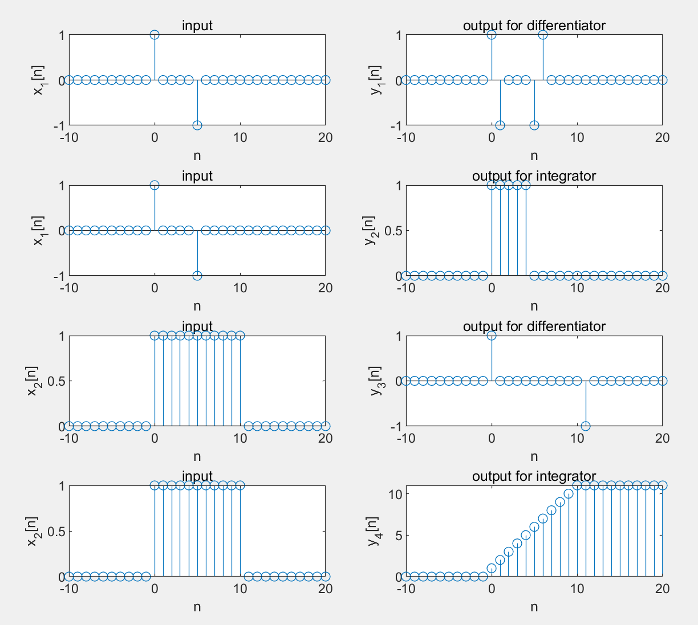
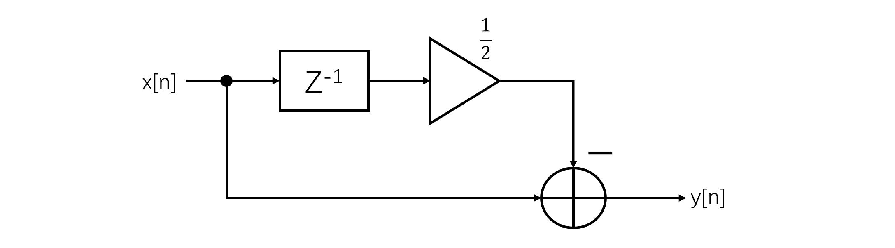

## <center>EE323 Digital Signal Processing</center>
## <center>Lab 2: Discrete-Time Systems</center>

>  **SID:** 11812214  
>
>  **Name:** 任振裕

### **Part 1: Introduction.**

+ In this lab, we mainly discuss the Discrete-Time Systems. And a definition to a discrete-time system is that anything that takes a discrete-time signal as input and generates a discrete- time signal as output. 
+ In order to understand discrete-time systems, it is important to first understand their classification into categories of linear/nonlinear, time-invariant/ time-varying, causal/noncausal, memoryless/with-memory, and stable/unstable. 
+ The main content contains in this lab:
  +  Background Exercises
  +  Example Discrete-Time Systems
  +  Difference Equations
  +  Audio Filtering
  +  Inverse Systems
  +  System Tests 
  +  Stock Market Example  


### **Part 2: Result & Analysis.**

#### 2.2 Background Exercises

**2.2.1 Example Discrete-time Systems**

+ For the DT approximation of differentiator:  $y(t)=\frac{d}{dt}x(t)$:

  We have difference equation： $y[n]=x[n]-x[n-1]$

+ For the DT approximation of integrator: $y(t)=\int_{-\infty}^tx(\tau)d\tau$:

  We have difference equation:  $y[n]-y[n-1]=x[n]$，which could be also wirtten as 
  $$y[n]=x[n]+y[n-1]$$;

+ Block diagram for these two discrete-time system (Figure 2.1):

  

<center>
    Figure 2.1 Block diagram<br>
    <font size="2">(from right to left: DT system for differntiator,DT system for integrator)
</center>

**2.2.2 Stock Market Example**

+ Let n be the $n_{th}$ day, $y[n]$ be avgvalue, and $x[n]$ be value.

  Then we have below three difference equations:
  $$
  \begin{aligned}
  System 1: y[n]&=\frac{1}{3}(x[n]+x[n-1]+x[n-2])\\
  System 2: y[n]&=0.8y[n-1]+0.2x[n]\\
  System 3: y[n]&=y[n-1]+\frac{1}{3}(x[n]-x[n-3])
  \end{aligned}
  $$
+ System diagrams for these three equations (Figure 2.2):


<center>
    Figure 2.2 Block diagram<br>
    <font size="2">(From top to bottom: System 1, System 2, System3.)</font><p>
</center>

+ Impulse response for these four systems:

$$
\begin{aligned}
System 1: h[n]&=\frac{1}{3}(\delta[n]+\delta[n-1]+\delta[n-2])\\
System 2: h[n]&=0.8h[n-1]+0.2\delta[n]\\
System 3: h[n]&=h[n-1]+\frac{1}{3}(\delta[n]-\delta[n-3])
\end{aligned}
$$

+ Methods (2.3) and methods (2.5) are known as moving average becasue the absolute value of weights applied on the time sequence is equal, which will make the average value line become smoother and much more flat.

#### 2.3 Example Discrete-Time Systems

+ Codes for two functions:

  ```matlab
  function y=differentiator(x)
  % y[n]=x[n]-x[n-1]
  x=[0 x];
  y=zeros(1,length(x)-1);
  for n=1:length(x)-1
      y(n)=x(n+1)-x(n);
  end
  end
  ```

  ```matlab
  function y=integrator(x)
  % y[n]=x[n]+y[n-1]
  y=zeros(1,length(x)+1);
  for n=1:length(x)
  y(n+1)=x(n)+y(n);
  end
  y=y(2:length(x)+1);
  end
  ```

+ Result:
  

<center>
    Figure 2.3 Inputs and outputs for four cases<br>
    <font size="2">(Inputs on the right,while outputs on the left.)<font>
</center>

+ Analysis:

  For these four cases, they all satisfy the BIBO stability.

#### 2.4 Differential Systems

+ Codes for two functions:

  ```matlab
  function y=S1(x)
  % y[n]=x[n]-x[n-1]
  N=length(x);
  x=[0 x];
  y=zeros(1,N);
  for n=1:N
      y(n)=x(n+1)-x(n);
  end
  end
  ```

   ```matlab
  function y=S2(x)
  % y[n]=(1/2)y[n-1]+x[n]
  N=length(x);
  y=zeros(1,N+1);
  for n=1:length(x)
  y(n+1)=x(n)+(1/2)*y(n);
  end
  y=y(2:N+1);
  end
   ```
  
+ Block diagram for each case:

  Block diagrams for $S_1$ and $S_2$:

  
  
  <center>Figure 2.4 Block diagrams for systems S1 and S2<br>
  <font size="2">(S1 on the right,while S2 on the left.)<font></center>
  
  Block diagrams for $S_1(S_2)$ and $S_2(S_1)$:
  
  
  
  <center>Figure 2.5 Block diagrams for systems S1(S2) and S2(S1)<br>
  <font size="2">( S1(S2) on the top,while S2(S1) on the bottom. )<font>
  </center>
  Block diagram for $S_1+S_2$:
  
  

<center>Figure 2.6 Block diagrams for systems S1+S2
</center>

+ Impulse responses for these five cases:

  

<center>
    Figure 2.7 Impulse responses of five systems 
</center>


+ Oberservations:
  + Impulse response of $S_1+S_2$ equals the sum of impulse responses of $S_1$ and $S_2$;(Parrallel connection results in addition.)
  + Impulse response of $S_1(S_2)$ is same with impulse response of $S_2(S_1)$, and the impulse response of this two system is $S_1 \otimes S_2$ ;(Series connection results in convolution.)

#### 2.5 Aduio Filtering

+ Code for this section:

  ```matlab
  clear;
  [s,fs]=audioread('music.au');
  s=s';
  s1=S1(s);
  s2=S2(s);
  sound(s1,fs);
  next=input('press any key to the next song');
  sound(s2,fs);
  ```

+ Analysis:

  + Compared with the original song, the song filtered by System $S_1$ is much more smoother.

  + Compared with the original song, the song filtered by System $S_2$ is louder and much more  tighter.

#### 2.6 Inverse Systems

+ For system $S_2$, we have $y_2[n]=\frac{1}{2}y_2[n-1]+x_2[n]$;

  For system $S_3$, we have $y_3[n]=ax_3[n]+bx_3[n-1]$, where $a$ and $b$ are constant;

  To calculate the output of $S_3(S_2)$, let $x_3[n]=y_2[n]$. After the variable substitution, we have:
  $$
  \begin{aligned}
  y_3[n]&=a(\frac{1}{2}y_2[n-1]+x_2[n])+by_2[n-1]\\
  &=(\frac{a}{2}+b)y_2[n-1]+ax_2[n]
  \end{aligned}
  $$
  Since we need $y_3[n]=x_2[n]$, then we have:
  $$
  \begin{cases}
  \frac{a}{2}+b=0\\
  a=1
  \end{cases}
  $$
  Therefore, $a=1$ and $b=-\frac{1}{2}$;

+ The difference equation for $S_3$: 
$$
y[n]=x[n]-\frac{1}{2}x[n-1]
$$

+ Block diagram for  $S_3$:

  

  <center>
      Figure 2.8 Block diagram for S3
  </center>

  
+ Code for function $S_3$:
  
  ```matlab
  function y=S3(x)
  %y[n]=x[n]-1/2x[n-1]
  N=length(x);
  x=[0 x];
  y=zeros(1,N);
  for n=1:N
      y(n)=x(n+1)-(1/2)*x(n);
  end
  end
  ```
  
+ Impulse response:
  
  

<center>
    Figure 2.9 Impulse response for S3 and S2 
</center>

#### 2.7 System Tests

+ Code for linearity test:

  ```matlab
  clear;
  % linearity test
  % check T{Ax1[n]+Bx2[n]}=A*T{x1[n]}+ B*T{x2[n]}
  x1=10*rand(1,10);x2=10*rand(1,10);
  figure(1)%input
  subplot(1,3,1),stem(x1),xlabel('n'),title('x1[n]');
  subplot(1,3,2),stem(x2),xlabel('n'),title('x2[n]');
  subplot(1,3,3),stem(2*x1+3*x2),xlabel('n'),title('2*x1[n]+3*x2[n]');
  
  figure(2)%linearity test
  orient('tall')
  sgtitle('linearity test')
  % bbox1
  subplot(3,2,1),stem(2*bbox1(x1)+3*bbox1(x2)),xlabel('n'),title('2*bbox1(x1)+3*bbox1(x2)');
  subplot(3,2,2),stem(bbox1(2*x1+3*x2)),xlabel('n'),title('bbox1(2*x1+3*x2)');
  % bbox2
  subplot(3,2,3),stem(2*bbox2(x1)+3*bbox2(x2)),xlabel('n'),title('2*bbox2(x1)+3*bbox2(x2)');
  subplot(3,2,4),stem(bbox2(2*x1+3*x2)),xlabel('n'),title('bbox2(2*x1+3*x2)');
  % bbox3
  subplot(3,2,5),stem(2*bbox3(x1)+3*bbox3(x2)),xlabel('n'),title('2*bbox3(x1)+3*bbox3(x2)');
  subplot(3,2,6),stem(bbox3(2*x1+3*x2)),xlabel('n'),title('bbox3(2*x1+3*x2)');
  ```
  
+ Code for time invariance test:

  ```matlab
  clear;
  % time invariance test
  n=-5:5;
  % let x denote x[n], x1 denote x1[n]=x[n-n0]
  % let y[n], y1[n] denote the outputs of x[n] and x1[n]
  % check y[n-n0]=y1[n]
  x=[zeros(1,3) ones(1,5) zeros(1,3)];%input
  x1=[zeros(1,5) ones(1,5) 0];% set n0=2
  nhead=-7:5;%find the new element after the right shifting
  xhead=[zeros(1,2) x];
  yahead=bbox1(xhead);yahead=yahead(1:2);
  ybhead=bbox2(xhead);ybhead=ybhead(1:2);
  ychead=bbox3(xhead);ychead=ychead(1:2);
  ya=bbox1(x); ya_delay=[yahead ya(1:length(ya)-2)]; ya1=bbox1(x1);
  yb=bbox2(x); yb_delay=[ybhead yb(1:length(yb)-2)]; yb1=bbox2(x1);
  yc=bbox3(x); yc_delay=[ychead yc(1:length(yc)-2)]; yc1=bbox3(x1);
  sgtitle('time invariance test')
  orient('tall')
  % bbox1
  subplot(321),stem(n,ya_delay),title('y[n-2] for bbox1'),xlabel('n');
  subplot(322),stem(n,ya1),title('y1[n] for bbox1'),xlabel('n');
  % bbox2
  subplot(323),stem(n,yb_delay),title('y[n-2] for bbox2'),xlabel('n');
  subplot(324),stem(n,yb1),title('y1[n] for bbox2'),xlabel('n');
  % bbox3
  subplot(325),stem(yc_delay),title('y[n-2] for bbox3'),xlabel('n');
  subplot(326),stem(yc1),title('y1[n] for bbox3'),xlabel('n');
  ```

+ Result for linearity test:

  

  <center>
      Figure 2.10 Linearity test
  </center>
  
  According to the figure above, system bbox1 is not linear.
  
+ Result for time invariance test:

  
  <center>
    Figure 2.11 Time invariance test
  </center>
  
  According to the figure above, system bbox3 is time varying.
  


#### 2.8 Stock Market Example

+ Codes for two functions：

  ```matlab
  function y=filter2_4(x)
  % y[n]=0.8y[n-1]+0.2x[n]
  N=length(x);
  y=zeros(1,N+1);
  for n=1:N
  y(n+1)=0.2*x(n)+0.8*y(n);
  end
  y=y(2:N+1);
  end
  ```

  ```matlab
  function y=filter2_5(x)
  % y[n]=y[n-1]+(1/3){x[n]-x[n-3]}
  N=length(x);
  y=zeros(1,N+1);
  x=[zeros(1,3) x];
  for n=1:N
      y(n+1)=y(n)+(1/3)*(x(n+3)-x(n));
  end
  y=y(2:N+1);
  end
  ```

+ Results:

  

  <center>
      Figure 2.12 Plots of the original and filtered exchange-rates
  </center>

+ Analysis:

  + For filter 2.4: 

    + Adavantages: As time passing, the filtered average value would gradually converge to a constant, and the average level line would be smoother.

    + Disadvantages: This filter need 10 ~ 15 days to reach a stable constant, which means that the waiting time is too long.

  + For filter 2.5:

    + Adavantages: The average value line is almost flat all the time, which means that there is nearly no waiting time.

    + Disadvantages: Compared with filter 2.4, the resulted average value line fluctuates a lot, and the filtered result is not stable.

  + Better methods for initializing the filter outputs: 
    + Collect 3 more passed original rates  as a "head" to initialize $x[n-3]$, $x[n-2]$, and $x[n-1]$.
    + Use $x[n-1]$ to approximate $y[n-1]$.

### **Part 3: Summary & Experience.**

+ Matlab is a very useful and powerful tool in digital signal processing. 
+ We could use many Matlab functions in signal processing toolbox to solve the problems.
+ To design an inverse system, we could use the method of underterminated coefficients.


