## <center>EE323 Digital Signal Processing</center>

## <center>Lab 4: Frequency Analysis</center>

> **SID:** 11812214  
>
> **Name:** 任振裕

### **Part 1: Introduction.**

+ In this experiment, we will use Fourier series and Fourier transforms to analyze continuous-time and
  discrete-time signals and systems. Studying the frequency response of an LTI system could give complete insight into a LTI system's behavior. Therefore it's really necessary to learn about it
+ In this experiment and others to follow, we will use the Simulink extension to Matlab. The main content for this lab is:
  + Background Exercises
  + Getting Started with Simulink
  + Continuous-Time Frequency Analysis
  + Discrete-Time Frequency Analysis


### **Part 2: Result & Analysis.**

#### 3.2 Background Exercises

##### **3.2.1 Synthesis of Periodic Signals**

**_Process:_**

+ Fourier series coefficients:
  $$
  a_k=\frac{1}{T}\int_Tx(t)e^{-j\omega_0t}\mathrm{d}x\tag{1}
  $$

+ Synthesis equation:
  $$
  x(t)=\sum_{k=-\infin}^{\infin}a_ke^{jk\omega_0t}\tag{2}
  $$

  $$
  x(t)=a_0+\sum_{k=1}^{\infin}2A_ksin(k\omega_0t+\theta_k)\tag{3}
  $$

  where $a_k=A_ke^{j\phi}$, $\theta_k=\phi+\pi/2$. (Proof of equation $(3)$ can be seen in the appendix;)
  
+ Fourier series coefficients for periodic square wave: 

  Period $T_0$; $s(t)=rect(\frac{t}{T}),\ if\ t\in[-\frac{T}{2},\frac{T}{2}]$; $T=2T_1$;

   <center>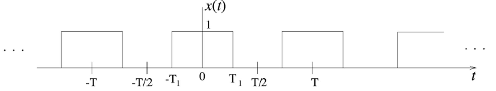</center>
  $$
  a_k=\frac{1}{T_0}\int_{-T_1}^{T_1}e^{-jk\omega_0t}\mathrm{d}t=\frac{sin(k\omega_0T_1)}{k\pi}\tag{4}
  $$

**_Case 1:_**

+ Period $T_0=2$. For $t\in[0,2]$, $s(t)=rect(t-\frac{1}{2})$;

  According to equation $(4)$ and the time shift property of Fourier coefficients, we have :
  $$
  a_k=\frac{sin(k\frac{\pi}{2})}{k\pi}e^{-jk\omega_0t_0}=\frac{sin(k\frac{\pi}{2})}{k\pi}e^{-jk\frac{\pi}{2}}
  $$
  According to equation $(1)$, we have: $a_0=\frac{1}{T_0}\int_{T_0}s(t)\mathrm{d}t=\frac{1}{2}$;

  According to equation $(3)$, we have:
  $$
  \begin{aligned}
  s(t)&=\frac{1}{2}+\sum_{k=1}^{\infin}\frac{2sin(k\frac{\pi}{2})}{k\pi}sin(k\pi t-k\frac{\pi}{2}+\frac{\pi}{2})\\
  \end{aligned}
  $$

+ $s(t)$ on $[0,T_0]$:

  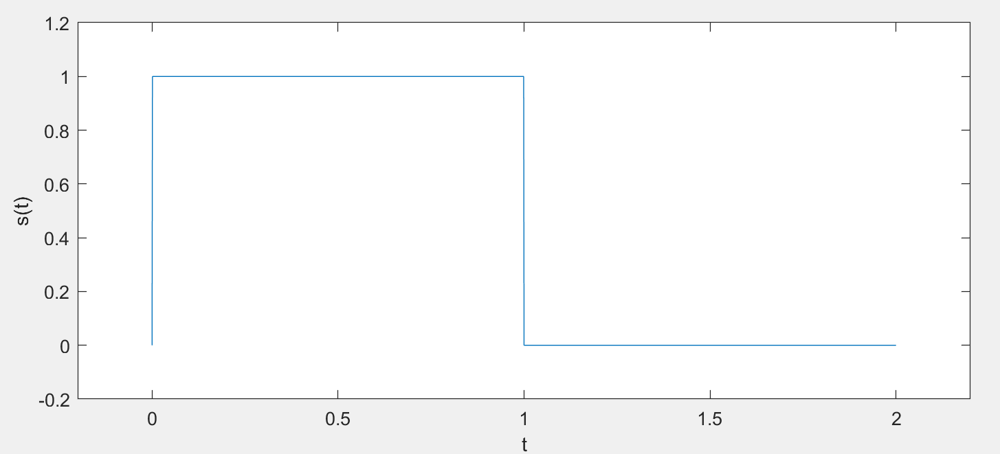

_**Case 2:**_

+ Period $T_0=1$. For $t\in[-\frac{1}{2},\frac{1}{2}]$, $s(t)=rect(2t)-\frac{1}{2}$;

  Similarly, when $k=0$, we have: $a_0=\frac{1}{T_0}\int_{T_0}s(t)\mathrm{d}t=0$;

  When, $k\neq0$, according to the equation $(4)$ the linearity property of Fourier coefficients, we have:
  
  $$
  a_k=\frac{sin(k\frac{\pi}{2})}{k\pi},when\ k\neq0
  $$
  
  $$
  \therefore s(t)=\sum_{k=1}^{\infin}\frac{2sin(k\frac{\pi}{2})}{k\pi}sin(2\pi kt+\frac{\pi}{2})
  $$
  
+ $s(t)$ on $[0,T_0]$:

  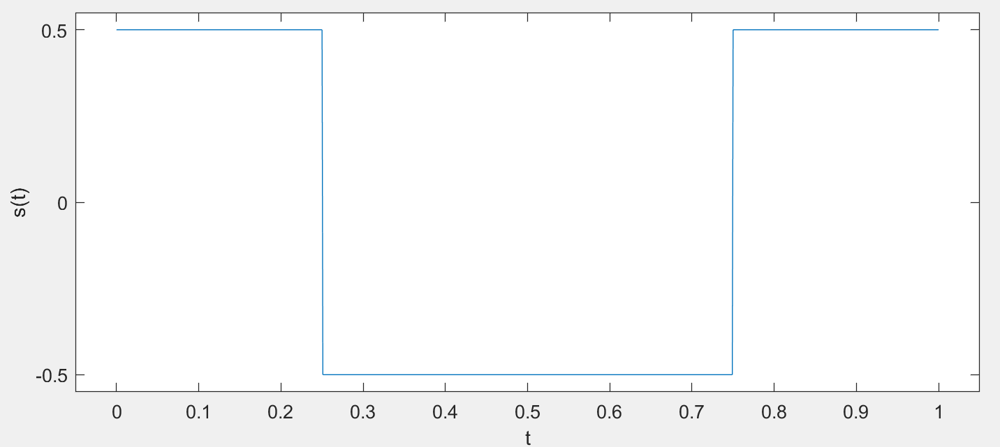

#### 3.4 Continuous-Time Frequency Analysis

##### 3.4.1 Synthesis of Periodic Signals

+ _**case 0:**_
  $$
  x(t)=0+\sum_{k=1\\k\ odd}^{13}\frac{4}{k\pi}sin(2\pi kt)
  $$
  Synthesis result:

  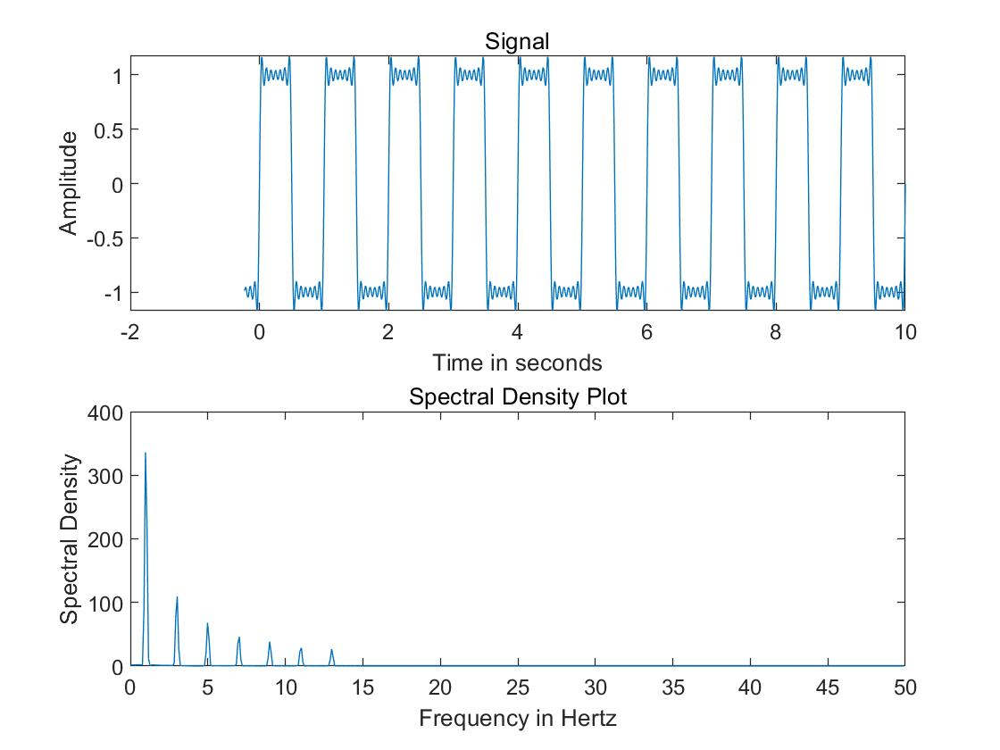

  Analysis: 
  
  + The synthesized waveform is quite similar to the desired but is not as flat as desired waveform. This is because that we just use $7$ sine waves ($13$ Fourier series components) to synthesize the waveform. As the number of waves we use increase and tend to infinity, the synthesized waveform will converge to the desired waveform.
  + There are $7$ impulses in the plot of spectral density, which respectively refers to  7 odd term of sine wave.(Center frequency: $k=\{1Hz,3Hz,...,13Hz\}$) The amplitue of these impulses are monotonically decreasing, which satisfies the terms of $\frac{4}{k\pi},\ k=\{1,3,...,13\}$.
  
+ _**case 1:**_
  $$
  \begin{aligned}
  s(t)&=\frac{1}{2}+\sum_{k=1}^{\infin}\frac{2sin(k\frac{\pi}{2})}{k\pi}sin(k\pi t-k\frac{\pi}{2}+\frac{\pi}{2})\\
  &\approx\frac{1}{2}+\sum_{k=1\\k\ odd}^{13}\frac{2(-1)^{\frac{k-1}{2}}}{k\pi}sin(k\pi t-k\frac{\pi}{2}+\frac{\pi}{2})
\end{aligned}
  $$
Synthesis settings for sine waves:
  
| k                 | 1    | 3         | 5        | 7         | 9        | 11         | 13        |
| ----------------- | ---- | --------- | -------- | --------- | -------- | ---------- | --------- |
| amplitude         | 2/pi | -2/(3*pi) | 2/(5*pi) | -2/(7*pi) | 2/(9*pi) | -2/(11*pi) | 2/(13*pi) |
| frequency (rad/s) | pi   | 3*pi      | 5*pi     | 7*pi      | 9*pi     | 11*pi      | 13*pi     |
| phase             | 0    | -pi       | -2*pi    | -3*pi     | -4*pi    | -5*pi      | -6*pi     |

  Synthesis result:

  <center>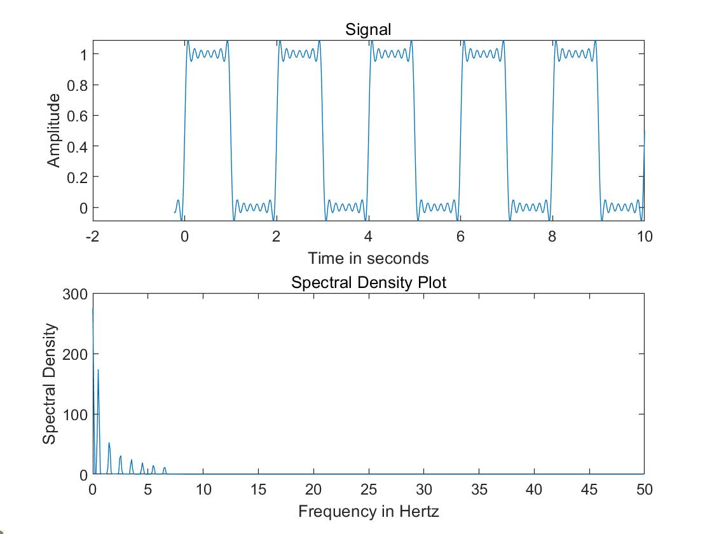</center>

+ Analysis: 

  + The synthesized waveform satisfies the condition that:
  
    Period $T_0=2$. For $t\in[0,2]$, $s(t)=rect(t-\frac{1}{2})$;
  
  + Compared with the desired wave, the synthesized waveform is not flat too. But as the number of waves we use increase and tend to infinity, the synthesized waveform will converge to the desired waveform.
  
  + In the spectral density plot, there are 7 impulses, which refers to 7 odd term of sine wave.(Center frequency: $k=\{1/2Hz,3/2Hz,...,13/2Hz\}$) .The amplitue of these impulses are monotonically decreasing, which also satisfies the given equation.
  
+ _**case 2:**_
  $$
  \begin{aligned}
  s(t)&=\sum_{k=1}^{\infin}\frac{2sin(k\frac{\pi}{2})}{k\pi}sin(2\pi kt+\frac{\pi}{2})
  \\&\approx\sum_{k=1\\k\ odd}^{13}\frac{2(-1)^{\frac{k-1}{2}}}{k\pi}sin(2\pi kt+\frac{\pi}{2})
  \end{aligned}
  $$
  Synthesis settings for sine waves:

  | k                 | 1    | 3         | 5        | 7         | 9        | 11         | 13        |
  | ----------------- | ---- | --------- | -------- | --------- | -------- | ---------- | --------- |
  | amplitude         | 2/pi | -2/(3*pi) | 2/(5*pi) | -2/(7*pi) | 2/(9*pi) | -2/(11*pi) | 2/(13*pi) |
  | frequency (rad/s) | 2*pi | 6*pi      | 10*pi    | 14*pi     | 18*pi    | 22*pi      | 26*pi     |
  | phase             | pi/2 | pi/2      | pi/2     | pi/2      | pi/2     | pi/2       | pi/2      |

  Synthesis result:

  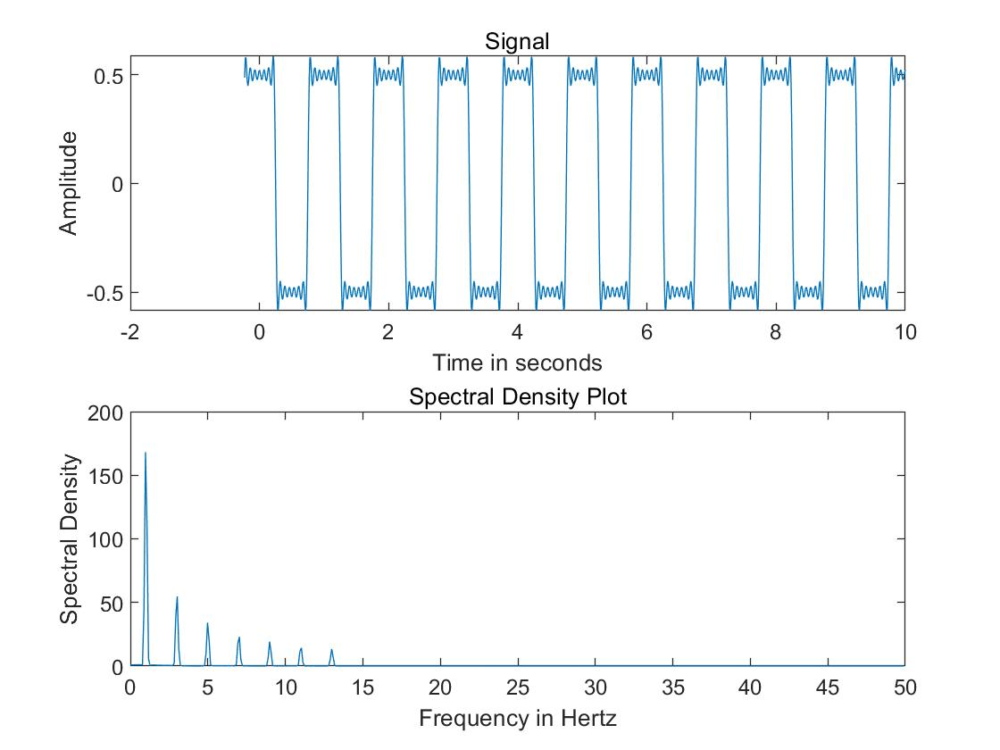

  Analysis:

  + The synthesized waveform satisfies the condition that:

    Period $T_0=1$. For $t\in[-\frac{1}{2},\frac{1}{2}]$, $s(t)=rect(2t)-\frac{1}{2}$;

  + Compared with the desired wave, the synthesized waveform is not flat too. But as the number of waves we use increase and tend to infinity, the synthesized waveform will converge to the desired waveform.

  + In the spectral density plot, there are 7 impulses, which refers to 7 odd term of sine wave.(Center frequency: $k=\{1Hz,3Hz,...,13Hz\}$) .The amplitue of these impulses are monotonically decreasing, which also satisfies the given equation.

##### 3.4.2 Modulation Property

+ Add another scope to verify the waveform of a Triangular wave:

  

+ Running result:

1. Triangular pulse duration of 1 sec; period of 2 sec; modulating frequency of 10 Hz (initial
   settings of the experiment).

   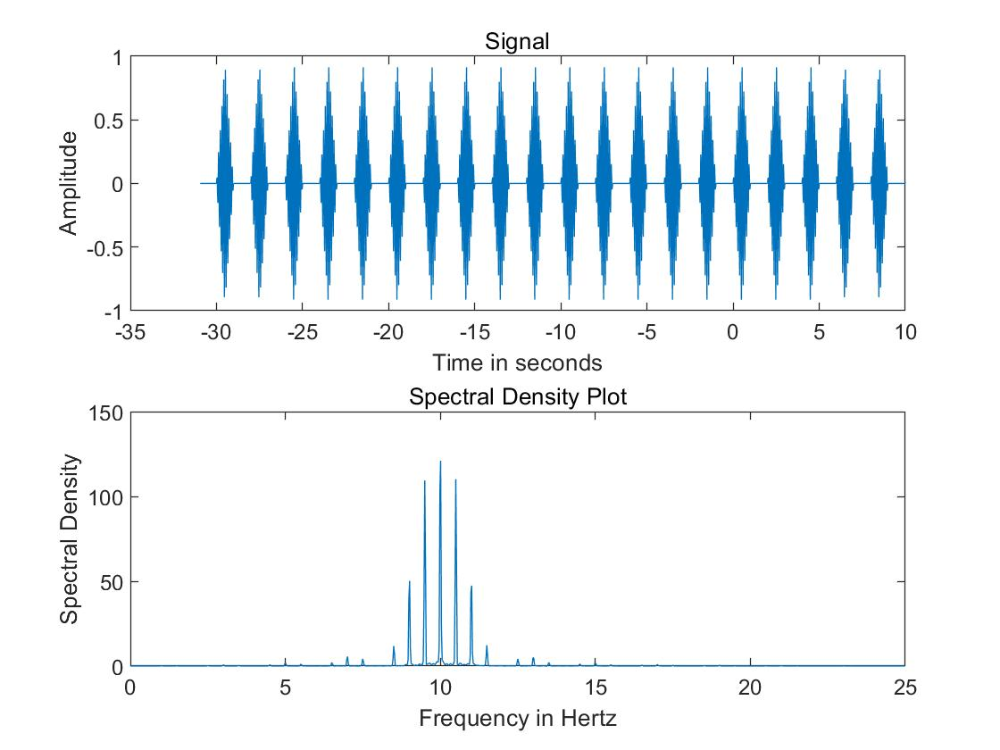

2. Triangular pulse duration of 1 sec; period of 2 sec; modulating frequency of 15 Hz.

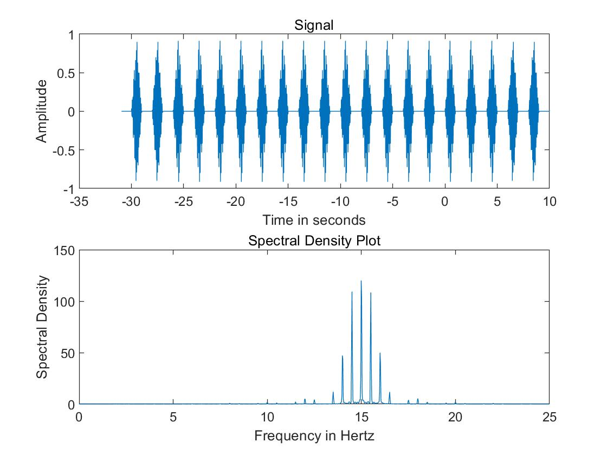

3. Triangular pulse duration of 1 sec; period of 3 sec; modulating frequency of 10 Hz.

   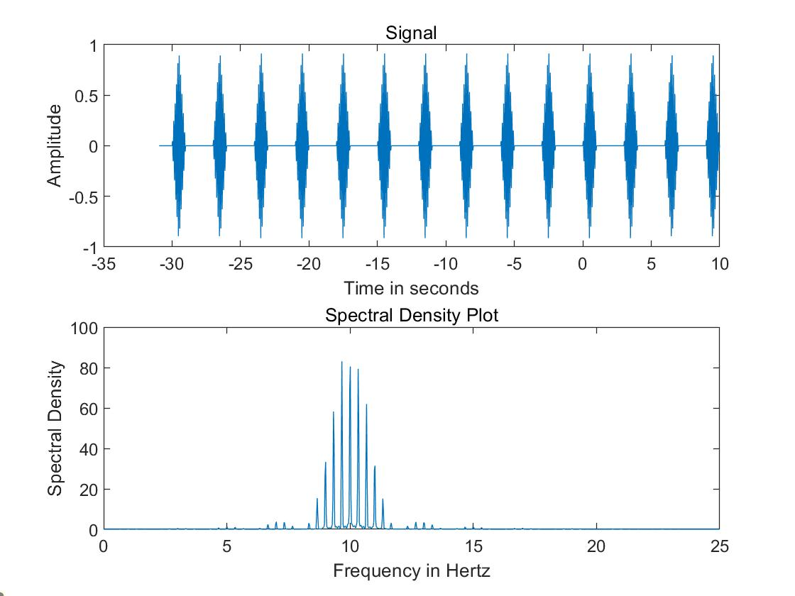

4. Triangular pulse duration of 1 sec; period of 6 sec; modulating frequency of 10 Hz.

   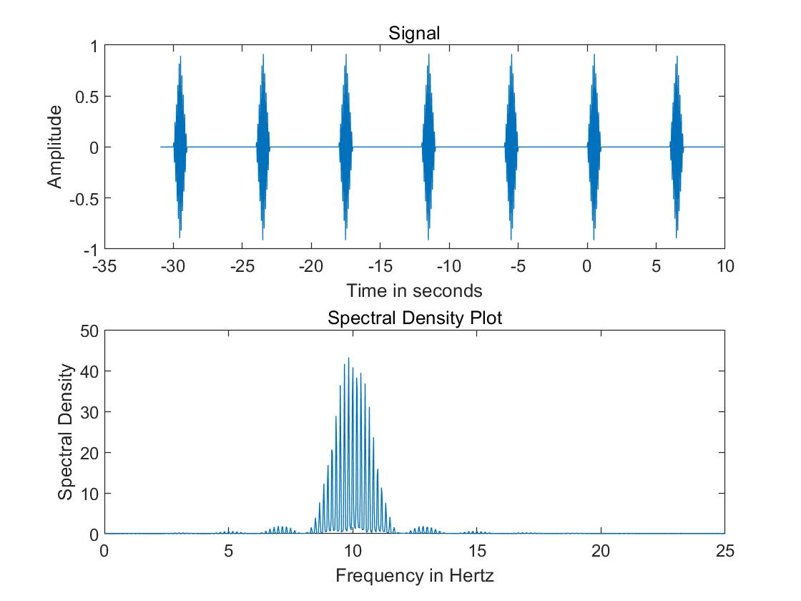

+ Analysis:

  1. Changing the modulating frequency will cause a frequency shift on the plot of spectral density. The value of the frequency shift is the modulating frequency of the sine wave.
     
  2. + The reason why the spectrum have a comb structure is that the Fourier Series Coefficients of the rectangular wave is in the shape of sinc wave.  
     + The distance between impulses is $1/T_0$, where $T_0$ is the period of the triangle wave. This is because that the triangular wave could be expressed as $x(t)=a_0+\sum_{k=1}^{\infin}2A_ksin(k\omega_0t+\theta_k)$, and the frequency difference between adjacent sine waves is $\omega_0/(2\pi)=1/T_0$.

  3. If the period of the triangle wave increases toward infinity, the distance between impulses would tend to be $0$, and the spectral density would be a continuous sinc function.
     

#### 3.5 Discrete-Time Frequency Analysis

##### 3.5.1 Discrete-Time Fourier Transform

+ Code for function DTFT:

  ```matlab
  function X=DTFT(x,n0,dw)
  %n0 time index of 1st element of x
  %dw spacing between the samples of the Matlab vector
  w=-pi:dw:pi;
  n=1+n0-1:length(x)+n0-1
  %X(k)=sum(x.*exp(-j*w(k).*n));
  for k=1:length(w)
      X(k)=sum(x.*exp(-j*w(k).*n));
  end
  end
  ```

+ Results:

  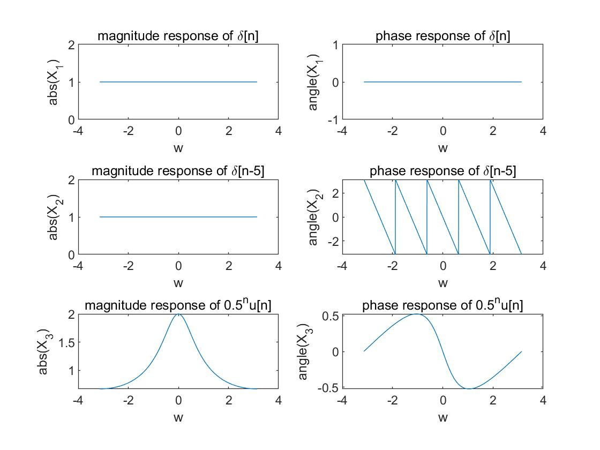

+ Analysis:

  + For all the phase resonse, there is a property that $\theta(\omega)=-\theta(-\omega)$ since these functions are all real valued.

  + For $x_1[n]=\delta[n]$, we have:

    + DTFT: $X_1(e^{j\omega})=1$;
  
    + magnitude response: $|X_1(e^{j\omega})|=1$, and this satisfies the plot;
  
  + phase response: $\angle X_1(e^{j\omega})=0$, and this satisfies the plot;
  
  + For $x_2[n]=\delta[n-5]$, we have:
  
    + DTFT: $X_2(e^{j\omega})=e^{-j\omega 5}$;
    
  + magnitude response: $|X_2(e^{j\omega})|=1$, and this satisfies the plot;
    
    + phase response: $\angle X_2(e^{j\omega})=-5\omega,\ when\ -\pi\leq-5\omega\leq \pi $, and this satisfies the plot;
  + For $x_3[n]=0.5^nu[n]$, we have:
  
    + DTFT: 
      $$
      \begin{aligned}
      X_3(e^{j\omega})&=\frac{1}{1-0.5e^{-j\omega}}=\frac{1}{1-0.5cos\omega+0.5jsin\omega}\\
      &=\frac{1}{\sqrt{(1-0.5cos\omega)^2+(0.5sin\omega)^2}e^{j(tan^{-1}\frac{0.5sin\omega}{1-0.5cos\omega})}}
      \\&=\frac{1}{\sqrt{1.25-cos\omega}}e^{-j(tan^{-1}\frac{0.5sin\omega}{1-0.5cos\omega})}
  \end{aligned}
      $$
  
    + magnitude response: $|X_3(e^{j\omega})|=\frac{1}{\sqrt{1.25-cos\omega}}$, and this satisfies the plot such that there is a peak value when $\omega=0$;
  
    + phase response: $\angle X_3(e^{j\omega})=e^{-j(tan^{-1}\frac{0.5sin\omega}{1-0.5cos\omega})}$, and this satisfies the plot;

### **Part 3: Summary.**

+ Simulink is a very powerful technique to do visble programming and simulations. With the extension of signal processing and DSP toolbax, we could easily achieve many signal processing methods.
+ Studying the frequency response of an LTI system could give complete insight into a LTI system's behavior.

### **Part 4: Appendix.**

Proof for equation (3)：
$$
\begin{aligned}
x(t)&=\sum_{k=-\infin}^{k=\infin}a_k e^{-jk\omega_0t}=a_o+\sum_{k=1}^{k=\infin}a_k e^{-jk\omega_0t}+a_{-k} e^{jk\omega_0t}\\
&\xlongequal[]{a_{-k}=a_k^*}a_0+\sum_{k=1}^{k=\infin}a_k e^{-jk\omega_0t}+a_{k}^* e^{jk\omega_0t}\\
&=a_0+2Real\{a_ke^{jk\omega_0t}\}\\
&\xlongequal[]{a_k=A_ke^{j\phi}}a_0+\sum_{k=1}^{\infin}2A_kcos(k\omega_t+\phi)\\
&=a_0+\sum_{k=1}^{\infin}2A_ksin(k\omega_t+\theta_k)\\
&where\ \theta_k=\phi+\pi/2,\ a_k=A_ke^{j\phi} 
\end{aligned}
$$