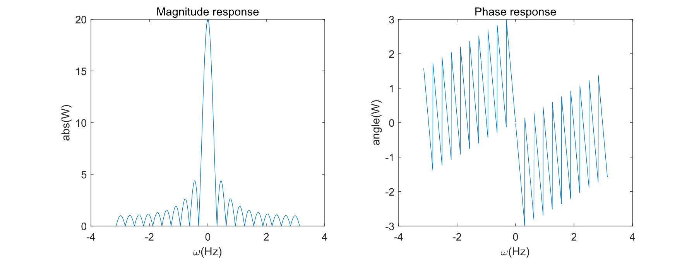
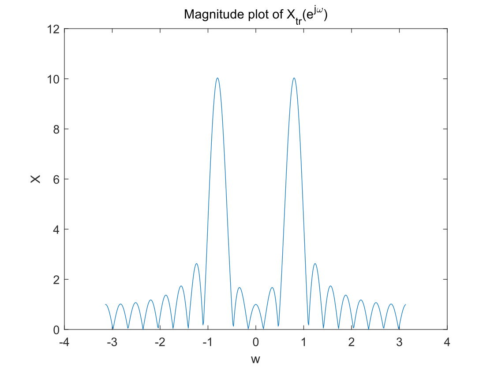
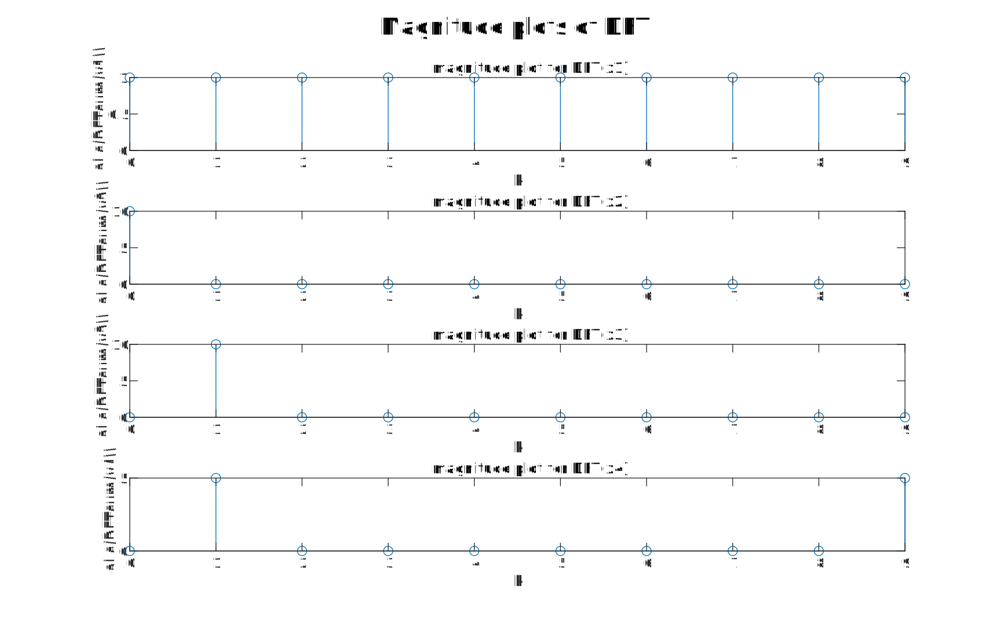
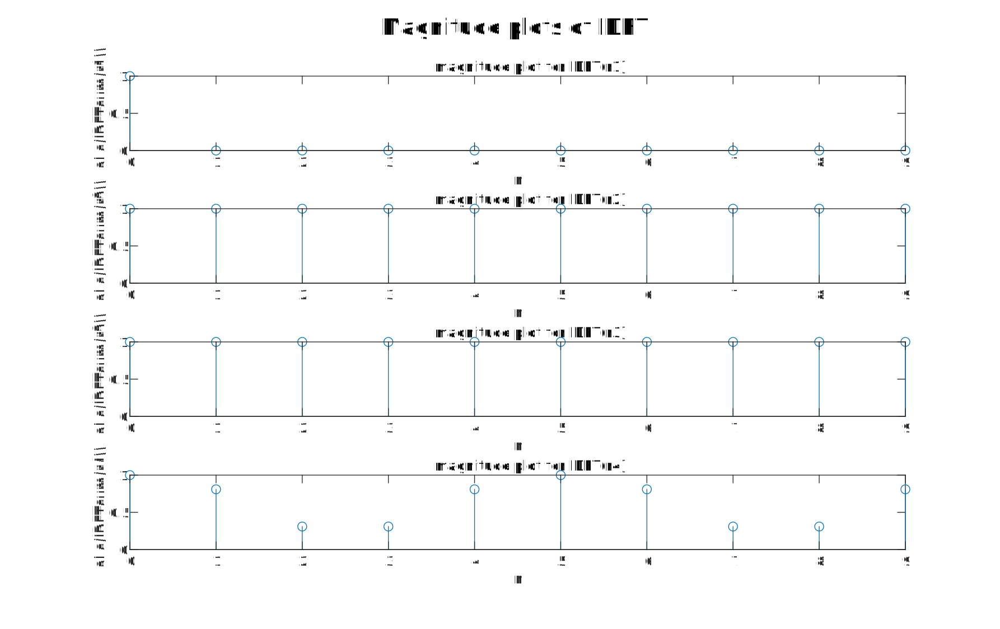
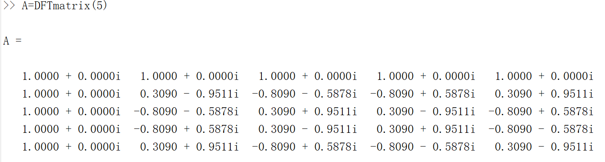
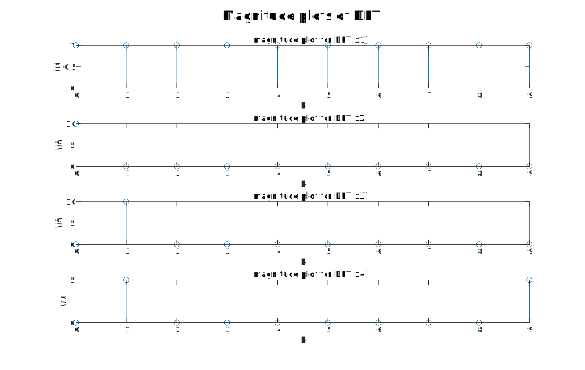
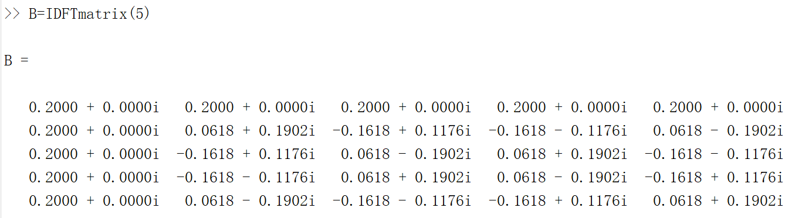
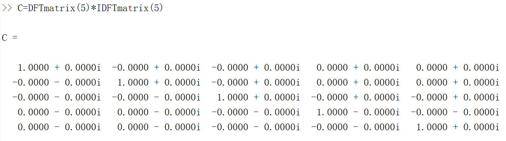
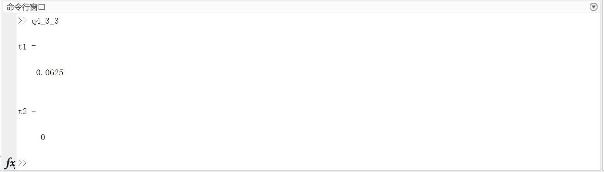

## <center>EE323 Digital Signal Processing</center>

## <center>Lab 4: Discrete Fourier Transform</center>

> **SID:** 11812214  
>
> **Name:** 任振裕

## 4.1 Introduction

This laboratory will introduce the Discrete Fourier Transform (DFT) and the associated sampling
and windowing effects.

The corresponding equations needed for this lab are listed below:

> _DTFT:  Discrete Time Fourier Transform._ 
> $$
> X(e^{j\omega})=\sum_{n=-\infin}^{\infin}x[n]e^{-j\omega n} \tag{1}
> $$
> _IDTFT: Inverse Discrete Time Fourier Transform._
> $$
> x[n]=\frac{1}{2\pi}\int_{-\pi}^{\pi}X(e^{j\omega})e^{j\omega n}\mathrm{d}\omega \tag{2}
> $$
> _DFT: Discrete Fourier Transform._
> $$
> X_N[k]=\sum_{n=0}^{N-1}x_N[K]e^{j2\pi kn/N} \tag{3}
> $$
> _IDFT: Inverse Discrete Fourier Transform._
> $$
> x[n]=\frac{1}{N}\sum_{k=0}^{N-1}X_N(k)e^{j2\pi kn/N} \tag{4}
> $$

The main content for this lab is：

[TOC]

<div STYLE="page-break-after: always;"></div>

## 4.2 Deriving the DFT from the DTFT

### 4.2.3 Windowing Effects

+ Phase and magnitude response of $W(e^{j\omega})$:

  `q1.m`

  ```matlab
  clear;
  N=20;
  w=-pi:pi/1000:pi;
  W = (w~=0).*exp(-j*w*(N-1)/2).*sin(w*N/2)./(sin(w/2))+(w == 0)*N;
  subplot(121),plot(w,abs(W)),xlabel('\omega(Hz)'),ylabel('abs(W)'),title('Magnitude response');
  subplot(122),plot(w,angle(W)),xlabel('\omega(Hz)'),ylabel('angle(W)'),title('Phase response');
  ```

  

+ An expression for $X(e^{j\omega})$:

  $\because$ $x[n]=cos(\frac{\pi n}{4})=\frac{1}{2}(e^{j\frac{\pi}{4}n}+e^{-j\frac{\pi}{4}n})$ and $Ft\{e^{j\omega_0 n}\}=\sum_{l=-\infin}^{\infin}2\pi\delta(\omega-\omega_0-2\pi l)$

  $\therefore$ We have: 
  
  $X(e^{j\omega})=\sum_{l=-\infin}^{\infin}\pi\delta(\omega-\frac{\pi}{4}-2\pi l)+\sum_{l=-\infin}^{\infin}\pi\delta(\omega+\frac{\pi}{4}-2\pi l)$
  
  More specifically,
  
  $X(e^{j\omega})=\pi\delta(\omega-\frac{\pi}{4})+\pi\delta(\omega+\frac{\pi}{4}),\qquad -\pi\leq\omega\leq\pi \tag{5}$
  
  And $X(e^{j\omega})$ has a period of $2\pi$.
  
+ Magnitude plot of $X_{tr}(e^{j\omega})$:

  `q2.m`

  ```matlab
  clear;
  % Truncate the signal
  n=0:19;
  x=cos(pi/4*n);
  [X,w]=DTFT(x,512);
  plot(w,abs(X)),xlabel('w'),ylabel('X'),title('Magnitude plot of X_{tr}(e^{j\omega})');
  ```

  
  
+ Difference between $|X_{tr}(e^{j\omega})|$ and $|X(e^{j\omega})|$:

  + According to previously derived equation (5), it could be observed that $|X(e^{j\omega})|$ is composed of two impulses in one period which are separately centered at  $\frac{\pi}{4}$ and $-\frac{\pi}{4}$.

  + However, according to the above figure (magnitude plot of $X_{tr}(e^{j\omega})$), it can be observed that $|X_{tr}(e^{j\omega})|$ is composed of two time-shiftings of a sinc waves. And actually, these sinc waves are centered at   $\frac{\pi}{4}$ and $-\frac{\pi}{4}$ respectively. 
    
    Proof for this argument is quite straightforward:
    
    According to the multiplication property of DTFT, we have:
$$
\begin{aligned}
      X_{tr}(e^{j\omega})&=Ft\{x[n]\times w[n]\}\\&=X(e^{j\omega})\circledast W(e^{j\omega})\\&=(\pi\delta(\omega-\frac{\pi}{4})+\pi\delta(\omega+\frac{\pi}{4}))\circledast W(e^{j\omega})\\&=\pi W(e^{j(\omega-\pi/4)})+\pi W(e^{j(\omega+\pi/4)})
      \end{aligned}\tag{6}
$$
​				Moreover, we can derive that $W(e^{j\omega})$ is a sinc wave:
$$
\begin{aligned}W\left(e^{j \omega}\right) &=\sum_{n=-\infty}^{\infty} w[n] e^{-j \omega n}=\sum_{n=0}^{N-1} e^{-j \omega n} \\&=\left\{\begin{array}{ll}\frac{1-e^{-j \omega N}}{1-e^{-j \omega}}, & \text { for } \omega \neq 0, \pm 2 \pi, \ldots \\N, & \text { for } \omega=0, \pm 2 \pi, \ldots\end{array}\right.\end{aligned}
\\
W\left(e^{j \omega}\right)=\frac{e^{-j \omega N / 2}}{e^{-j \omega / 2}} \frac{e^{j \omega N / 2}-e^{-j \omega N / 2}}{e^{j \omega / 2}-e^{-j \omega / 2}}=e^{-j \omega(N-1) / 2} \frac{\sin (\omega N / 2)}{\sin (\omega / 2)}\tag{7}
$$
  ​		Proof completed.

+ Effects of using a different length of the window:

  According to equation (6) ,(7), using different length of the window will both change the amplitude and zero points of  $X_{tr}(e^{j\omega})$.

## 4.3 The Discrete Fourier Transform

### 4.3.1 Computing the DFT

_**Section A: DFTsum**_

+ MATLAB codes:

  `DFTsum.m`

  ```matlab
  function X = DFTsum(x)
  % X_N[k]=\sum_{n=0}^{N-1}x[n]e^{-j*2*pik*n/N}
  % X(k)=\sum_{n=1}^Nx(n)e^(-j*2*pi*(k-1)*(n-1)/N), 1≤k≤N
  N = length(x);
  X = zeros(1,N);
  for k=1:N
  for n=1:N
      X(k)= X(k)+x(n)*exp(-j*2*pi*(k-1)*(n-1)/N);
  end
  end
  end
  ```

  `magnitudePlots.m`

  ```matlab
  clear;
  n=[0:9];%N=10;
  x1=(n==0);
  x2=ones(1,10);
  x3=exp(j*2*pi*n/10);
  x4=cos(2*pi*n/10);
  figure(1)% DFT plots
  sgtitle('Magnitude plots')
  subplot(411),stem([1:10],abs(DFTsum(x1))),xlabel('k'),ylabel('abs(DFTsum(x1))'),title('magnitude plot for DFT(x1)')
  subplot(412),stem([1:10],abs(DFTsum(x2))),xlabel('k'),ylabel('abs(DFTsum(x2))'),title('magnitude plot for DFT(x2)')
  subplot(413),stem([1:10],abs(DFTsum(x3))),xlabel('k'),ylabel('abs(DFTsum(x3))'),title('magnitude plot for DFT(x3)')
  subplot(414),stem([1:10],abs(DFTsum(x4))),xlabel('k'),ylabel('abs(DFTsum(x4))'),title('magnitude plot for DFT(x4)')
  ```

+ 

+ Closed-form analytical expressions for DFT：

  According to equation (3), we have ($N=10$):
  
  + Case 1: $x[n]=\delta[n]$
  
    $X[k]=\sum_{n=0}^9\delta[n]e^{\frac{-j2\pi kn}{N}}=1,\qquad k=0,1,...,9$
  
  + Case 2: $x[n]=1$
  
    $X[k]=\sum_{n=0}^9e^{\frac{-j2\pi kn}{N}}=10\delta[k], \qquad k=0,1,...,9$
  
  + Case 3: $x[n]=e^{j2\pi n/10}$
  
    $X[k]=\sum_{n=0}^9e^{\frac{j2\pi(1-k)n}{N}}=10\delta[k-1], \qquad k=0,1,...,9$
  
  + Case 4: $x[n]=cos(2\pi n/10)$
  
    $X[k]=\sum_{n=0}^9cos(2\pi n/10)e^{\frac{-j2\pi kn}{N}}=\sum_{n=0}^9\frac{1}{2}(e^{j2\pi n/10}+e^{-j2\pi n/10})e^{\frac{-j2\pi kn}{N}}\\=\frac{1}{2}\sum_{n=0}^9e^{\frac{j2\pi(1-k)n}{N}}+\frac{1}{2}\sum_{n=0}^9e^{\frac{j2\pi(-1-k)n}{N}}=5\delta[k-1]+5\delta[k+1]$
  
    $\because\ k=0,1,...,9$ 
  
    We have: $X[k]=5\delta[k-1],\qquad k=0,1,...,9$
  
    > Case 2, 3, 4 all use the property below to simplify the computation:
    > $$
    > W_N=e^{-j*2\pi/N}\\\sum_N W_N^{kn}= \begin{cases}N,\qquad k=mN\\0, \qquad otherwise\end{cases}
    > $$

_**Section B: IDFTsum**_

+ MATLAB codes:

  `IDFTsum.m`

  ```matlab
  function x = IDFTsum(X)
  % x[n]=\frac{1}{N}\sum_{k=0}^{N-1}X_N(k)e^{j2\pi kn/N}
  % x(n)=(1/N)\sum_{k=1}^{N}X(k)*exp(j*2*pi*(k-1)*(n-1)/N),1≤n≤N
  N = length(X);
  x = zeros(1,N);
  for n=1:N
  for k=1:N
      x(n)=x(n)+(1/N)*sum(X(k)*exp(j*2*pi*(k-1)*(n-1)/N));
  end
  end
  end
  ```

  Add below codes to previous `magnitudePlots.m`:

  ```matlab
  figure(2)% IDFT plots
  r1=IDFTsum(X1);r2=IDFTsum(X2);r3=IDFTsum(X3);r4=IDFTsum(X4);
  sgtitle('Magnitude plots of IDFT')
  subplot(411),stem([0:9],abs(r1)),xlabel('n'),ylabel('abs(IDFTsum(r1))'),title('magnitude plot for IDFT(r1)')
  subplot(412),stem([0:9],abs(r2)),xlabel('n'),ylabel('abs(IDFTsum(r2))'),title('magnitude plot for IDFT(r2)')
  subplot(413),stem([0:9],abs(r3)),xlabel('n'),ylabel('abs(IDFTsum(r3))'),title('magnitude plot for IDFT(r3)')
  subplot(414),stem([0:9],abs(r4)),xlabel('n'),ylabel('abs(IDFTsum(r4))'),title('magnitude plot for IDFT(r4)')
  ```

+ 

+ Analysis: `IDFTsum.m ` successfully recovers the original signal, which means that the design of  `IDFTsum.m` is right.

### 4.3.2 Matrix Representation of the DFT

_**Section A: DFTmatrix**_

+ MATLAB codes:

  `DFTmatrix.m`

  ```matlab
  function A = DFTmatrix(N)
  A=zeros(N,N);
  for k=1:N
  for n=1:N
      A(k,n)=exp(-j*2*pi*(k-1)*(n-1)/N);
  end
  end
  end
  ```

+ Print-outs for matrix **A** for N=5:

  
  
+ Magnitude plots for DFT's:

  `q4_3_2.m`

  ```matlab
  clear;
  n=[0:9]';%N=10;
  x1=(n==0);x2=ones(10,1);x3=exp(j*2*pi*n/10);x4=cos(2*pi*n/10);
  A=DFTmatrix(10);
  X1=A*x1;X2=A*x2;X3=A*x3;X4=A*x4;
  figure(1)% DFT plots
  sgtitle('Magnitude plots of DFT')
  subplot(411),stem([1:10]',abs(X1)),xlabel('k'),ylabel('X1'),title('magnitude plot for DFT(x1)')
  subplot(412),stem([1:10]',abs(X2)),xlabel('k'),ylabel('X2'),title('magnitude plot for DFT(x2)')
  subplot(413),stem([1:10]',abs(X3)),xlabel('k'),ylabel('X3'),title('magnitude plot for DFT(x3)')
  subplot(414),stem([1:10]',abs(X4)),xlabel('k'),ylabel('X4'),title('magnitude plot for DFT(x4)')
  ```

  

+ To calculate DFT using matrix product, we need $N^2$ multiples, which means a computing complexity of $O(n^2)$.

_**Section B: IDFTmatrix**_

+ MATLAB codes:

  `IDFTmatrix.m`

  ```matlab
  function B = IDFTmatrix(N)
  A=DFTmatrix(N);
  B=(1/N)*A';
  end
  ```

+ Print-outs for matrix **B** for N=5:

  

+ Print out the elements of 𝐂 = 𝐁𝐀：

  

+ Analytical expression for the elements of 𝐁:
  $$
  B_{kn}=\frac{1}{N}e^{j2\pi(k-1)(n-1)/N}
  $$

### 4.3.3 Computation Time Comparison

+ MATLAB codes to test the cputime;

```matlab
clear;
n=0:511;x=cos(2*pi*n);A=DFTmatrix(512);
% DFTsum     t1
start1=cputime;X=DFTsum(x);end1=cputime;t1=end1-start1;display(t1);
x=x';
% DFTmatrix     t2
start2=cputime;X=A*x;end2=cputime;t2=end2-start2;display(t2);
```

+ Running Result:



+ Analysis:
  + Method using DFTsum costs 0.0625s to calculate the DFT.
  + However, method using DFTmatrix almost costs no time.
  + After several repetitions, the same conclusion hold that the cputime of DFTmatrix is almost zero while method using DFTsum approximately cost 0.4$-$0.6s time.
  + Although the complexity of these two methods are same, method using DFTsum is explicitly lower than method using DFTmatrix. This is because that  `DFTsum.m` uses two "for" loops in the algorithm which runs quite slow in MATLAB while the other method only involves the matrix operations which is exact the strength of MATLAB. 

## 4.4 Conclusion & Experience

### 4.4.1 Conclusion.

+ DFT actually uses $\omega=2\pi k/N$ to sample the DTFT.

+ There are two ways to calculate DFT and IDFT:

  + Use DFTsum to calculate:
    $$
    \begin{aligned}&\text { (DFT) } &\qquad X_{N}[k]=\sum_{n=0}^{N-1} x[n] e^{-j 2 \pi k n / N}\\&\text { (inverse DFT) } &\qquad x[n]=\frac{1}{N} \sum_{k=0}^{N-1} X_{N}[k] e^{j 2 \pi k n / N}\end{aligned}
    $$

  + Use DFTmatrix to calculate:
    $$
    \begin{aligned}
    \text{(DFT)}:
    \begin{cases}
    X&=Ax\\
    X_k&=\sum_{n=1}^NA_{kn}x_n\\
    A_{kn}&=e^{-j2\pi(k-1)(n-1)/N}
    \end{cases}\\
    \text{(inverse DFT)}:
    \begin{cases}
    x&=BX\\
    x_n&=\sum_{k=1}^NB_{kn}X_k\\
    B_{kn}&=\frac{1}{N}e^{j2\pi(k-1)(n-1)/N}
    \end{cases}\\
    \end{aligned}
    $$

+ In MATLAB programming, we should always try to avoid using any "for" loops to make the program running faster.

### 4.4.2 Experience.

+ Writing down the relative equations could help me understand the principles of this lab better.
+ We should always try our best to avoid using "for" loops in MATLAB programming.

$$
W_N=e^{-j*2\pi/N}\\\sum_N W_N^{kn}= \begin{cases}N,\qquad k=mN\\0, \qquad otherwise\end{cases}
$$

