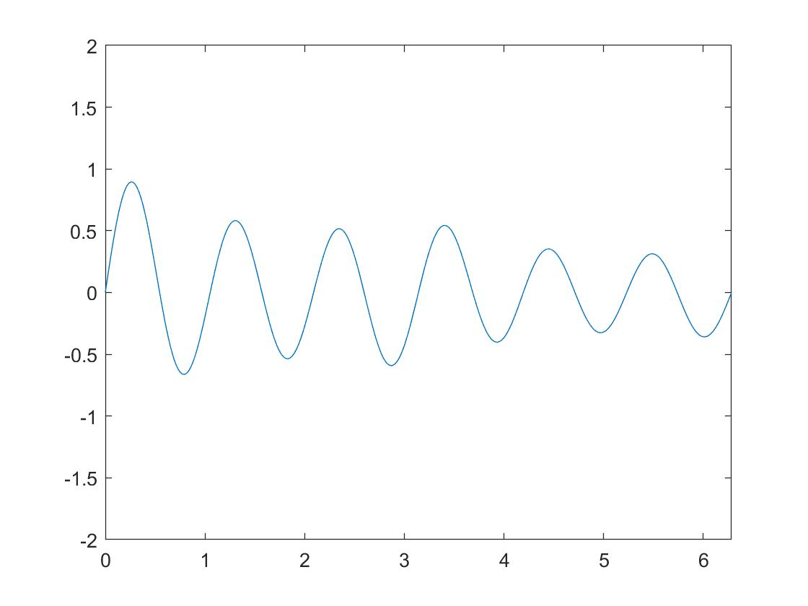

## <center>EE323 Digital Signal Processing</center>

## <center>Mini Project: 计算机生成和播放音乐</center>

> **SID:** 11812214  
>
> **Name:** 任振裕

### Exercise 1 音调. 

+ `num2freq.m`

  ```matlab
  function freq = num2freq(num)
  % 1,2,3,4,5,6,7：低八度
  % 8,9,10,11,12,13,14:中音
  % 15,16,17,18,19,20,21:高八度
  % num2freq(1)=440Hz
  a = 1:12;
  freqlist=440.*2.^((a-1)./12);
  % display(freqlist)
  % freqlist =
  % 
  %   440.0000  466.1638  493.8833  523.2511  554.3653  587.3295  622.2540  659.2551  698.4565  739.9888  783.9909  830.6094
  base = [freqlist(1) freqlist(3) freqlist(5) freqlist(6) freqlist(8) freqlist(10) freqlist(12)];
  % display(base)
  % base =
  % 
  %   440.0000  493.8833  554.3653  587.3295  659.2551  739.9888  830.6094
  b=floor(num/7);
  c=rem(num,7);
  if num <= 0
      freq = 0;
  else
      if (c >0)
          freq=base(c).*2.^b;
      else
          freq=base(7).*2.^(b-1);
      end   
  end
  ```

+ `q1.m`

  ```matlab
  clear;
  % test
  for i=1:21
  freq(i) = num2freq(i);
  end
  fprintf("Input: 0, output: "+num2freq(0)+" Hz\n")
  for i=1:21
      fprintf("Input: "+i+", output: "+freq(i)+" Hz\n")
  end
  ```

+ A demo output for my code:

  > \>\> q1
  >
  > Input: 0, output: 0 Hz
  > Input: 1, output: 440 Hz
  > Input: 2, output: 493.8833 Hz
  > Input: 3, output: 554.3653 Hz
  > Input: 4, output: 587.3295 Hz
  > Input: 5, output: 659.2551 Hz
  > Input: 6, output: 739.9888 Hz
  > Input: 7, output: 830.6094 Hz
  > Input: 8, output: 880 Hz
  > Input: 9, output: 987.7666 Hz
  > Input: 10, output: 1108.7305 Hz
  > Input: 11, output: 1174.6591 Hz
  > Input: 12, output: 1318.5102 Hz
  > Input: 13, output: 1479.9777 Hz
  > Input: 14, output: 1661.2188 Hz
  > Input: 15, output: 1760 Hz
  > Input: 16, output: 1975.5332 Hz
  > Input: 17, output: 2217.461 Hz
  > Input: 18, output: 2349.3181 Hz
  > Input: 19, output: 2637.0205 Hz
  > Input: 20, output: 2959.9554 Hz
  > Input: 21, output: 3322.4376 Hz

+ Analysis: 1-7 低八度，8-14 中音，15-21 高八度；0 停顿， 频率为0.

### Exercise 2 调号.

+ `freq2num.m`

  ```matlab
  function freq = num2freq(num,scale)
  % 1,2,3,4,5,6,7：低八度
  % 8,9,10,11,12,13,14:中音
  % 15,16,17,18,19,20,21:高八度
  
  % 在原有基础上添加一个判断语句
  % freq0 为低八度的1
  switch(scale)
      case'A'
          freq0=440;
      case'B'
          freq0=494;
      case'C'
          freq0=261.5;
      case'D'
          freq0=293.5;
      case'E'
          freq0=329.5;
      case'F'
          freq0=349;
      case'G'
          freq0=391.5;
  end
  
  % 原函数  
  a = 1:12;
  freqlist=freq0.*2.^((a-1)./12);
  base = [freqlist(1) freqlist(3) freqlist(5) freqlist(6) freqlist(8) freqlist(10) freqlist(12)];
  b=floor(num/7);
  c=rem(num,7);
  if num <= 0
      freq = 0;
  else
      if (c >0)
          freq=base(c).*2.^b;
      else
          freq=base(7).*2.^(b-1);
      end   
  end
  ```
  
+ `q2.m`

  ```matlab
  clear;
  freq_2_D=num2freq(2,'D');
  disp(freq_2_D); 
  ```
  
+ Demo output:

  >\>\> q2
  >
  >329.4426

### Exercise 3 生成不同频率波形.

+ `gen_wave.m`

  ```matlab
  function waves= gen_wave(tone,rhythm,fs,scale)
  %tone为数字音符，rhythm为节拍，即每个音符持续时长，fs为采样频率，scale为调号
  if(tone==-1)%4#
      freq=831.4086;
  elseif(tone==-2)%5#
      freq=933;
  else
      freq=num2freq(tone,scale);
  end
  x=linspace(0,2*pi*rhythm,rhythm*fs);
  waves=sin(freq.*x);
  end
  ```

+ `gen_music.m`

  ```matlab
  function s=gen_music(fs,rhythm)
  % fs = 8192;rhythm = 0.25;
  
  s = [];
  a = gen_wave(13, rhythm*0.5, fs, 'D');
  s = [s a];
  a = gen_wave(14, rhythm*0.5, fs, 'D');
  s = [s a];
  a = gen_wave(15, rhythm*1.5, fs, 'D');
  s = [s a];
  a = gen_wave(14, rhythm*0.5, fs, 'D');
  s = [s a];
  a = gen_wave(15, rhythm, fs, 'D');
  s = [s a];
  a = gen_wave(17, rhythm, fs, 'D');
  s = [s a];
  a = gen_wave(14, rhythm*3, fs, 'D');
  s = [s a];
  a = gen_wave(10, rhythm, fs, 'D');
  s = [s a];
  a = gen_wave(13, rhythm*1.5, fs, 'D');
  s = [s a];
  a = gen_wave(12, rhythm*0.5, fs, 'D');
  s = [s a];
  a = gen_wave(13, rhythm, fs,'D');
  s = [s a];
  a = gen_wave(15, rhythm, fs, 'D');
  s = [s a];
  a = gen_wave(12, rhythm*2, fs, 'D');
  s = [s a];
  a = gen_wave(0, rhythm, fs, 'D');
  s = [s a];
  a = gen_wave(10, rhythm, fs, 'D');
  s = [s a];
  a = gen_wave(11, rhythm*1.5, fs, 'D');
  s = [s a];
  a = gen_wave(10, rhythm*0.5, fs, 'D');
  s = [s a];
  a = gen_wave(11, rhythm*0.5, fs, 'D');
  s = [s a];
  a = gen_wave(15, rhythm*1.5, fs, 'D');
  s = [s a];
  a = gen_wave(10, rhythm*2, fs, 'D');
  s = [s a];
  a = gen_wave(0, rhythm*0.5, fs, 'D');
  s = [s a];
  a = gen_wave(15, rhythm*1.5, fs, 'D');
  s = [s a];
  a = gen_wave(14, rhythm*1.5, fs, 'D');
  s = [s a];
  a = gen_wave(-1, rhythm*1.5, fs, 'D');
  s = [s a];
  a = gen_wave(14, rhythm*1, fs, 'D');
  s = [s a];
  a = gen_wave(14, rhythm*2, fs, 'D');
  s = [s a];
  a = gen_wave(0, rhythm*1, fs, 'D');
  s = [s a];
  a = gen_wave(13, rhythm*0.5, fs, 'D');
  s = [s a];
  a = gen_wave(14, rhythm*0.5, fs, 'D');
  s = [s a];
  a = gen_wave(15, rhythm*1.5, fs, 'D');
  s = [s a];
  a = gen_wave(14, rhythm*0.5, fs, 'D');
  s = [s a];
  a = gen_wave(15, rhythm, fs, 'D');
  s = [s a];
  a = gen_wave(17, rhythm, fs, 'D');
  s = [s a];
  a = gen_wave(14, rhythm*2, fs, 'D');
  s = [s a];
  a = gen_wave(0, rhythm, fs, 'D');
  s = [s a];
  a = gen_wave(10, rhythm, fs, 'D');
  s = [s a];
  a = gen_wave(13, rhythm*1.5, fs, 'D');
  s = [s a];
  a = gen_wave(12, rhythm*0.5, fs, 'D');
  s = [s a];
  a = gen_wave(13, rhythm, fs, 'D');
  s = [s a];
  a = gen_wave(15, rhythm, fs, 'D');
  s = [s a];
  a = gen_wave(12, rhythm*3, fs, 'D');
  s = [s a];
  a = gen_wave(0, rhythm*0.5, fs, 'D');
  s = [s a];
  a = gen_wave(10, rhythm*0.5, fs, 'D');
  s = [s a];
  a = gen_wave(11, rhythm, fs, 'D');
  s = [s a];
  a = gen_wave(15, rhythm*0.5, fs, 'D');
  s = [s a];
  a = gen_wave(14, rhythm*1.5, fs, 'D');
  s = [s a];
  a = gen_wave(15, rhythm, fs, 'D');
  s = [s a];
  a = gen_wave(16, rhythm, fs, 'D');
  s = [s a];
  a = gen_wave(17, rhythm*0.5, fs, 'D');
  s = [s a];
  a = gen_wave(15, rhythm, fs, 'D');
  s = [s a];
  a = gen_wave(0, rhythm, fs, 'D');
  s = [s a];
  a = gen_wave(15, rhythm, fs, 'D');
  s = [s a];
  a = gen_wave(14, rhythm*0.5, fs, 'D');
  s = [s a];
  a = gen_wave(13, rhythm, fs, 'D');
  s = [s a];
  a = gen_wave(14, rhythm, fs, 'D');
  s = [s a];
  a = gen_wave(-2, rhythm, fs, 'D');
  s = [s a];
  a = gen_wave(13, rhythm*2, fs, 'D');
  s = [s a];
  a = gen_wave(0, rhythm, fs, 'D');
  s = [s a];
  a = gen_wave(15, rhythm*0.5, fs, 'D');
  s = [s a];
  a = gen_wave(16, rhythm*0.5, fs, 'D');
  s = [s a];
  a = gen_wave(17, rhythm*1.5, fs, 'D');
  s = [s a];
  a = gen_wave(16, rhythm*0.5, fs, 'D');
  s = [s a];
  a = gen_wave(17, rhythm, fs, 'D');
  s = [s a];
  a = gen_wave(19, rhythm, fs, 'D');
  s = [s a];
  a = gen_wave(16, rhythm*2, fs, 'D');
  s = [s a];
  a = gen_wave(0, rhythm, fs, 'D');
  s = [s a];
  a = gen_wave(12, rhythm, fs, 'D');
  s = [s a];
  a = gen_wave(15, rhythm*0.5, fs, 'D');
  s = [s a];
  a = gen_wave(14, rhythm*0.5, fs, 'D');
  s = [s a];
  a = gen_wave(15, rhythm, fs, 'D');
  s = [s a];
  a = gen_wave(17, rhythm, fs, 'D');
  s = [s a];
  a = gen_wave(17, rhythm*2, fs, 'D');
  s = [s a];
  a = gen_wave(0, rhythm*2, fs, 'D');
  s = [s a];
  a = gen_wave(13, rhythm*0.5, fs, 'D');
  s = [s a];
  a = gen_wave(14, rhythm*0.5, fs, 'D');
  s = [s a];
  a = gen_wave(15, rhythm, fs, 'D');
  s = [s a];
  a = gen_wave(14, rhythm, fs, 'D');
  s = [s a];
  a = gen_wave(16, rhythm, fs, 'D');
  s = [s a];
  a = gen_wave(15, rhythm*1.5, fs, 'D');
  s = [s a];
  a = gen_wave(12, rhythm*1.5, fs, 'D');
  s = [s a];
  a = gen_wave(0, rhythm, fs, 'D');
  s = [s a];
  a = gen_wave(18, rhythm, fs, 'D');
  s = [s a];
  a = gen_wave(17, rhythm, fs, 'D');
  s = [s a];
  a = gen_wave(16, rhythm, fs, 'D');
  s = [s a];
  a = gen_wave(15, rhythm, fs, 'D');
  s = [s a];
  a = gen_wave(17, rhythm*4, fs, 'D');
  s = [s a];
  a = gen_wave(17, rhythm*2, fs, 'D');
  s = [s a];
  a = gen_wave(0, rhythm, fs, 'D');
  s = [s a];
  a = gen_wave(17, rhythm, fs, 'D');
  s = [s a];
  a = gen_wave(20, rhythm*2, fs, 'D');
  s = [s a];
  a = gen_wave(19, rhythm*2, fs, 'D');
  s = [s a];
  a = gen_wave(17, rhythm*0.5, fs, 'D');
  s = [s a];
  a = gen_wave(16, rhythm*0.5, fs, 'D');
  s = [s a];
  a = gen_wave(15, rhythm, fs, 'D');
  s = [s a];
  a = gen_wave(0, rhythm*0.5, fs, 'D');
  s = [s a];
  a = gen_wave(15, rhythm*0.5, fs, 'D');
  s = [s a];
  a = gen_wave(16, rhythm, fs, 'D');
  s = [s a];
  a = gen_wave(15, rhythm*0.5, fs, 'D');
  s = [s a];
  a = gen_wave(16, rhythm, fs, 'D');
  s = [s a];
  a = gen_wave(19, rhythm, fs, 'D');
  s = [s a];
  a = gen_wave(17, rhythm*2, fs, 'D');
  s = [s a];
  a = gen_wave(0, rhythm, fs, 'D');
  s = [s a];
  a = gen_wave(17, rhythm, fs, 'D');
  s = [s a];
  a = gen_wave(20, rhythm*2, fs, 'D');
  s = [s a];
  a = gen_wave(19, rhythm*2, fs, 'D');
  s = [s a];
  a = gen_wave(17, rhythm*0.5, fs, 'D');
  s = [s a];
  a = gen_wave(16, rhythm*0.5, fs, 'D');
  s = [s a];
  a = gen_wave(15, rhythm*2, fs, 'D');
  s = [s a];
  a = gen_wave(0, rhythm*0.5, fs, 'D');
  s = [s a];
  a = gen_wave(15, rhythm*0.5, fs, 'D');
  s = [s a];
  a = gen_wave(16, rhythm, fs, 'D');
  s = [s a];
  a = gen_wave(15, rhythm*0.5, fs, 'D');
  s = [s a];
  a = gen_wave(16, rhythm, fs, 'D');
  s = [s a];
  a = gen_wave(14, rhythm, fs, 'D');
  s = [s a];
  a = gen_wave(13, rhythm*2, fs, 'D');
  s = [s a];
  a = gen_wave(0, rhythm, fs, 'D');
  s = [s a];
  a = gen_wave(13, rhythm*0.5, fs, 'D');
  s = [s a];
  a = gen_wave(14, rhythm*0.5, fs, 'D');
  s = [s a];
  a = gen_wave(13, rhythm*4, fs, 'D');
  s = [s a];
  end
  ```
  
+ Sound the music and save it.

  `q3.m`
  
  ```matlab
  clear;
  fs=8192;
  rhythm=0.25;
  s=gen_music(fs,rhythm);
  sound(s,fs);
  audiowrite('q3_output.wav', s, fs);
  ```

+ Output for this section: `q3_output.wav` which is saved in the folder "q3".

### Exercise 4: 音量波动. 

+ Primitive sound in example 2: 

  `example2.py`

  ```matlab
  clear;
  fs = 8192;
  rhythm=1;
  x = linspace(0, 2 * pi * rhythm, fs * rhythm);
  y = sin(440*x);
  plot(x,y);
  axis([0,2*pi,-2,2]);
  sound(y, fs);
  
  ```

  

  <center>
      Fig.1 Waveform of example 2
  </center>

  Just a sound of "du~", which is obviously not a sound of music. And also, the soud is very harsh. So we need to do some operations to change it.

+ Add an envelope attenuation function  to the code of example 2 , we could fluctuate the music quanlity.

  We have following cases:

  + Exponential envelope attenuation:

    Add an exponential envelope attenuation function: `waves = y.*exp(-x/(rhythm * 2* pi));` 

    

    <center>
        Fig.2 Exponential envelope attenuation
    </center>

  
  Analysis: After add the exponential envelope term, the music quanlity becomes a little smoother. Specifically, it's like a piano sound.
  
+ Linear envelope attenuation:
  
  Add a linear envelope attenuation function: `waves=y.*(1-(1/max(x))*x)`
  
    
  
    <center>
        Fig.3 Linear envelope attenuation
    </center>
  
    Analysis: The tail of the sound attenuates much more naturally, which makes a better  music quality than Exponetial envelope and primitive sound.  Specifically, it's like a trumpet sound.
  
+ As far as I'm concerned, I think linear envelope attenuation sounds the best. Because the waveform (Release part) of the linear envelope is more likely to the ADSR envelope (which is shown in the below). And definitely, linear envelope attenuation handles the tail of the musicbox much better than exponetial envelope attenuation.

  

<center>
    Fig.4 ADSR envelope
</center>

### Exercise 5: 泛音/不同乐器的音色区别.

+ Standing wave energy ratio : $0.8^2:0.1^2:0.0.5^2:0.025^2$.

  Add a line of code: `y = 0.8*sin(freq * x)+0.1*sin(2*freq * x)+0.05*sin(3*freq * x)+0.025*sin(4*freq * x);`


<center>
    Fig.5 Case 1
</center>

+ Standing wave energy ratio : $0.1^2:0.8^2:0.0.5^2:0.025^2$.

  Add a line of code: `y = 0.1*sin(freq * x)+0.8*sin(2*freq * x)+0.05*sin(3*freq * x)+0.025*sin(4*freq * x);`


<center>
    Fig.6 Case 2
</center>


+ Standing wave energy ratio : $0.05^2:0.1^2:0.8^2:0.025^2$.

  Add a line of code: `y = 0.1*sin(freq * x)+0.8*sin(2*freq * x)+0.05*sin(3*freq * x)+0.025*sin(4*freq * x);`



<center>
    Fig.7 Case 3
</center>

+ Standing wave energy ratio : $0.025^2:0.1^2:0.05^2:0.8^2$.

  

<center>
    Fig.8 Case 4
</center>

+ As I increase the amplitude of high frequncy comennets, the resulted waveform woild become tignter with much more wave peaks. 

  As far as I'm concerned, case 4 could lead to better music quanlity.